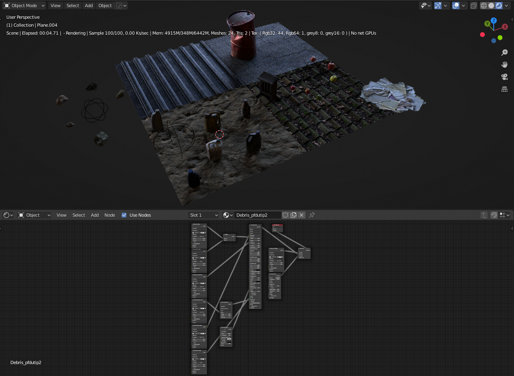
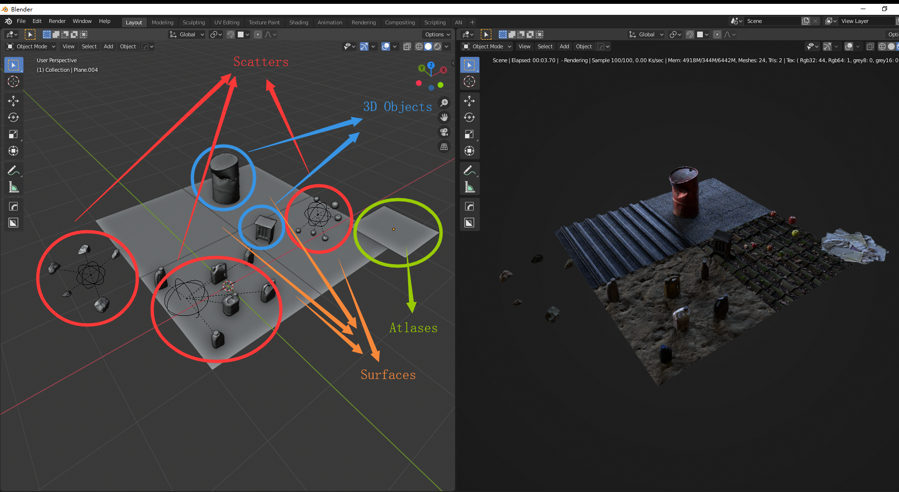
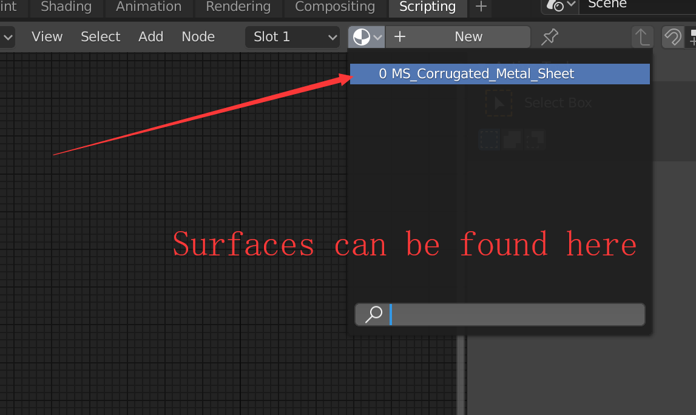
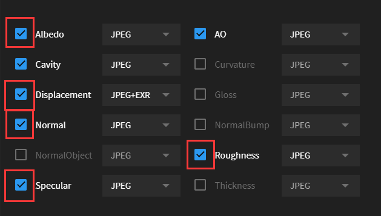

# OC-Blender-Helper-Addon

A helper addon for Octane Blender edition

> I developed this addon for speeding up user workflow, so users can access functions powered by Octane and AI, and newcomers can know where to start

> I welcome issue reports, please let me know where to promote and fix

> Glhf

## Versions

* **OctaneRender™ for Blender XXX and later**
* Current version **v3.0.0**
  * Tested on **Blender_Octane_Edition_XXX** (latest)
  * Developed on **Electron**, **Angular**, **NodeJS**, **Tensorflow**, **Blender**

## Installation 

* Go to [Releases](https://github.com/Yichen-Dou/OC-Blender-Helper-Addon/releases)
* Download the newest **Octane_Helper_[Platform].zip**
* Blender Preferences > Add-ons > Install
* Select **Octane_Helper.zip** to install
  * Please do not install the zip from the downloaded repository named OC-Blender-Helper-Addon-master.zip
* Activate it
  * If you had installed the addon before, please restart your Blender

## Features

**Octane Helper Menu**

XXX

**Megascans Livelink Module**

* Make sure the **Octane render is enabled**, otherwise the addon declines to import the asset
* It starts automatically when you open the Octane Blender
* There is no UI button to activate it (there was a button in old versions)
* Make sure you do not have the **Official Livelink Addon** installed. Otherwise, this module keeps silent to any import
* The imported surface material can be found in Material Slots
  * It will not be applied to selected objects
  * You can also use Right-Click menu > Materials > Paste to paste the surface material

**Minimum textures to get a correct response for Megascans Livelink**

**Supported Textures for Megascans Livelink**

| Textures         | Info                             |
| ---------------- | -------------------------------- |
| **Albedo**       | Added by default (If exists)     |
| **Displacement** | Added by default (If exists)     |
| **Normal**       | Added by default (If exists)     |
| **Roughness**    | Added by default (If exists)     |
| **Specular**     | Added by default (If exists)     |
| Opacity          | Added by default (If exists)     |
| Translucency     | Added by default (If exists)     |
| Metalness        | Added by default (If exists)     |
| AO               | Added by default (If exists)     |
| Bump             | Optional (Toggle in preferences) |
| Fuzz             | Optional (Toggle in preferences) |
| Cavity           | Optional (Toggle in preferences) |
| Curvature        | Optional (Toggle in preferences) |

## Questions

* Megascans Livelink module does not respond to imports
  * Some assets' meshes cannot be imported due to issues with built-in fbx/obj importer, which will be fixed in the future
  * Starting from 2020, when you first time launch the Bridge App and click the "Download Plugin", the Bridge App automatically puts an Blender addon that occupies the port communicating with Bridge at startup into **C:\Users\\[Your username]\AppData\Roaming\Blender Foundation\Blender\2.9[X]\scripts\startup** (Windows). It's called "MSPlugin", please remove the folder and restart the Blender
  * There is no on/off button for the official quixel addon that is why you have to remove it for using Octane. If you want to use the addon for cycles/eevee again, just simply recover the official addon, then the Octane megascans module will keep silent
* Other issues
  * Please check out the log from Blender > Top Bar > Window > Toggle System Console and let me know what's happening
